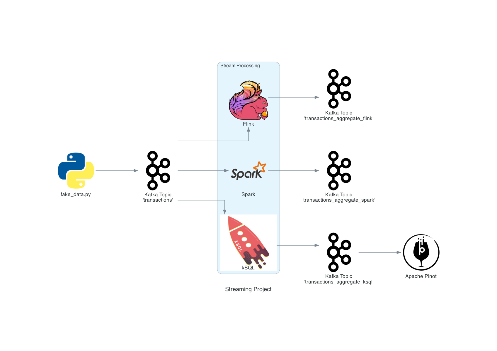
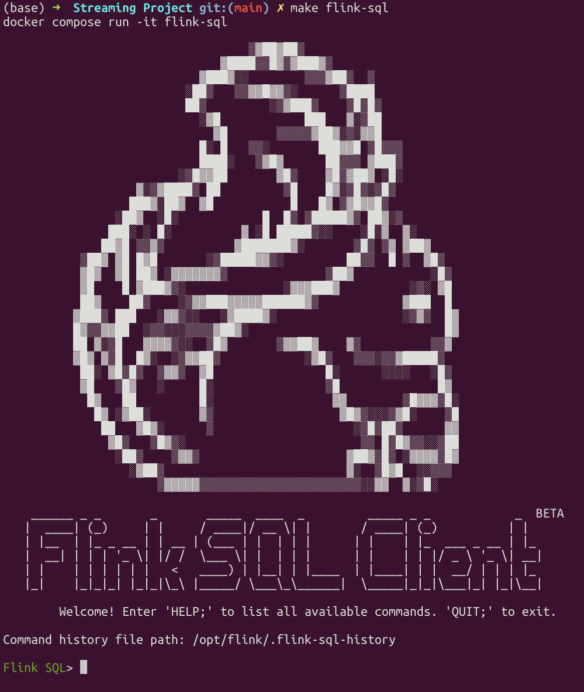
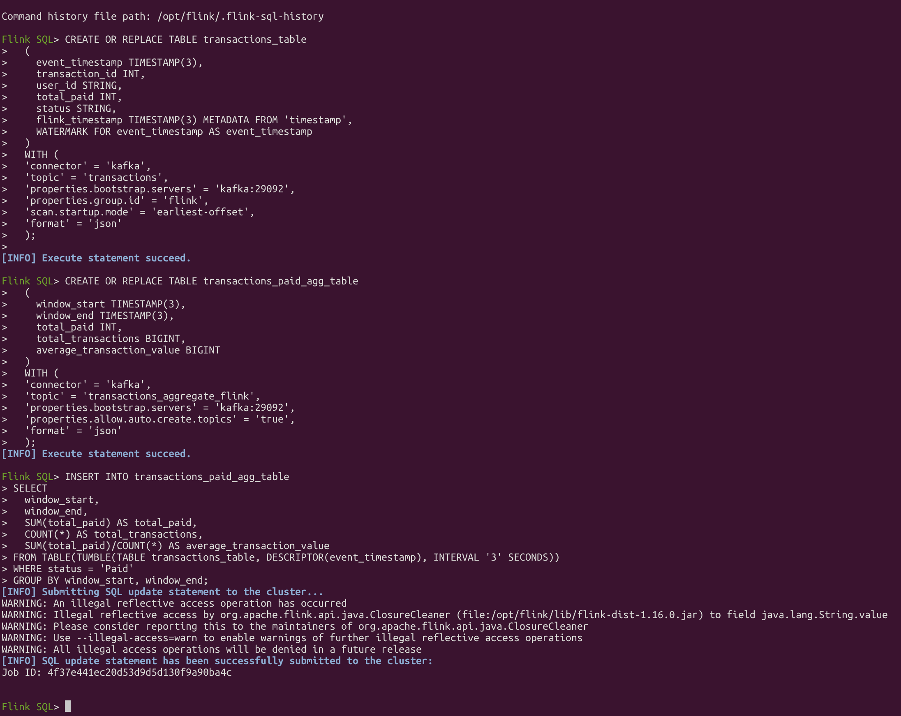
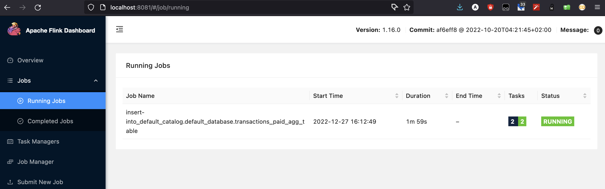
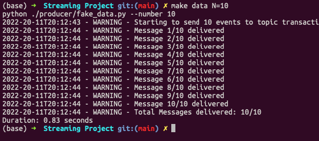
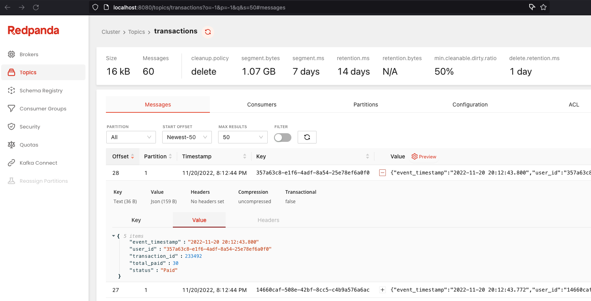
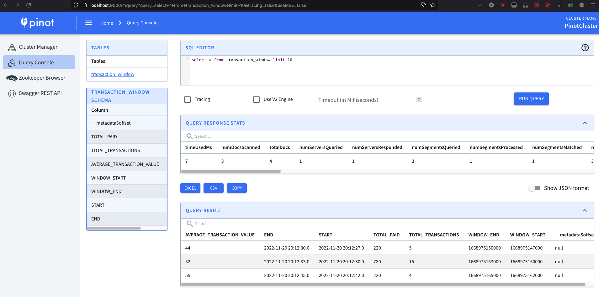

# Stream Processing Project

This is a personal project that I started with the goal to study and use some of the most used stream-processing technologies.

## Technologies Used
- [x] [Apache Kafka](https://kafka.apache.org/documentation/)
- [x] [kSQL](https://docs.ksqldb.io/en/latest/)
- [x] [Apache Pinot](https://docs.pinot.apache.org/)
- [x] [Apache Flink](https://nightlies.apache.org/flink/flink-docs-master/)
- [ ] Apache Spark
- [ ] Apache Superset

## Architecture

As of today, the project architecture is:



Using the Python library `faker`, we create fake `transaction` data to simulate a generic e-commerce. Our main goal is to aggregate those transactions in 3-second windows to know our income in real-time (as we shall see below).

The data is produced by the `fake_data.py` script. One can notice that we hard-coded a list of 10 `user_id`s. This was done to help debugging and ensure correctness of our stream pipelines, since each `user_id` start with a number from 0 to 9 and the each user pays a fixed amount equal to ten times its leading number (with `0` being interpreted as `10`). As an example, the user with leading number `5` will always pay the amount of `50`.

We then use both `Apache Flink` and `kSQL` to process the data. Our goal is to group all the **paid** transactions into **3 second windows** and calculate:
- the sum of what was paid;
- the number of transactions;
- the average of transactions.

As we can see in the [Techonologies](#technologies) section, we intend to add `Spark` as the last stream-processing technology and `Superset` as a visualization layer.

## Instructions

In order to run the project, just run the command `make project`. This will start all the docker containers and generate (almost) all the necessary resources in each container.

Since `Flink` doesn't have a REST API to programatically define the stream transformations, one must run 
```bash
make flink-sql
```

to start a container with the [Flink SQL Client](https://nightlies.apache.org/flink/flink-docs-master/docs/dev/table/sqlclient/).



Once in there, just copy & paste all the `SQL` instructions located in the `flink` folder (in the same order as the files are numbered). By the end of it, the `CLI` should report that a Job has been submited to `Flink`:



You can go to [localhost:8081](http://localhost:8081) and you shall see the Job Running:



With all that done, run `make data N={{ number }}` to send `{{ number }}` of messages to `Kafka`. The script will send the `{{ number }}` messages using 10 parallel processes. 



You can visualize the messages sent using the Kafka UI available at [localhost:8080](http://localhost:8080). The messages are sent to the `transactions` topic. `kSQL` stores the aggregations at the `transactions_aggregate_ksql` topic and `Flink` stores the results in the `transactions_aggregate_flink` topic.



Then, you can see the resulting tables in `pinot` using the `pinot-controller` interface at [localhost:9000](http://localhost:9000).



If needed, more commands are available in the `Makefile`.

## Notes

- In case it is needed, the `ksql` CLI is available by running `make ksql-cli`.

## Learnings

- We need to send a key to Kafka topic in order to use `table` in `kSQL`. See Topic #6 in https://www.confluent.io/blog/troubleshooting-ksql-part-1/.
- The `ROWTIME` pseudo-column available in `kSQL`: https://docs.ksqldb.io/en/latest/developer-guide/ksqldb-reference/create-stream/#rowtime

## Design Choices

We delibery chose to **not** use default Docker images of said technologies whenever possible. Since each one can be downloaded and run locally, we chose to do (almost) the same thing using Docker containers. This allowed us to know more about the configurations available in each one (as one can see in the `config`) folder.

## References
- https://www.confluent.io/blog/real-time-analytics-with-kafka-and-pinot/
- https://docs.pinot.apache.org/basics/getting-started/running-pinot-in-docker